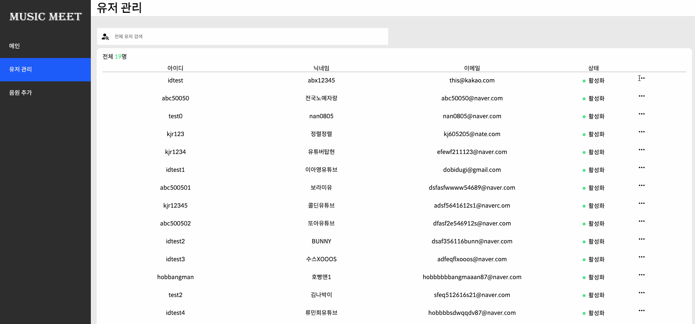

# ADMIN

이 프로젝트는 졸업작품 [MUSIC_MEET](https://github.com/MUSIC-MEET/MUSIC_MEET)의 Admin 페이지입니다.


## 소개

유저의 계정을 검색할 수 있으며 유저의 계정 상태를 컨트롤할 수 있다.


## 사용 기술

### Backend

Java11, Spring Boot, JPA(Spring-Data-JPA), MySql, REST-API

### Frontend

React, TypeScript, react-query, emotion, Axios

### SCM

GitHub, Notion (https://dobidugi.notion.site/MUSIC_MEET-bdb3df5bf78641a8870d946b371ce7ac)

### etc

postman, ERDcloud (https://www.erdcloud.com/d/csnqvMvSeFevxJy8q)

## 실행방법

### Backend 실행 방법

빌드

```bash
cd Backend/
./gradlew build
```


실행

./gradlew build 실행 후 나온 music_meet_admin-0.0.1-SNAPSHOT.jar 파일을

music_meet/Backend/music_meet/build/libs/ 위치로 이동 시킨 후 아래의 명령어를 사용하여 실행시킨다.

```bash
java -jar MUSIC_MEET/Backend/music_meet/build/libs/music_meet_admin-0.0.1-SNAPSHOT.jar
```


### Frontend 실행 방법

```bash
cd Frontend/
npm install --legacy-peer-deps && npm start
```


## 화면



회원 관리 및 음원 등록

